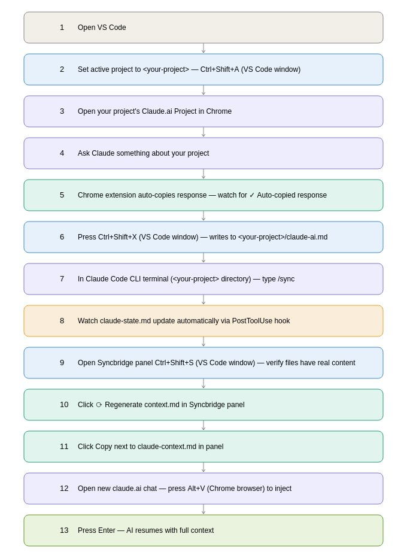

# Syncbridge

AI chat to CLI sync bridge for VS Code.

## Requirements
- VS Code 1.100.0 or higher
- Claude Code CLI installed and accessible in terminal
- Node.js v18+

## Installation
**From VS Code Marketplace:**
Search for "Syncbridge" in the Extensions panel and click Install.

**From .vsix file:**
```
code --install-extension syncbridge-0.0.1.vsix
```

## MCP server (Claude Code CLI integration)

Connect Syncbridge directly to Claude Code CLI as an MCP tool:

```bash
claude mcp add syncbridge node /path/to/syncbridge/mcp-server/index.js
```

Available tools:
- `update_state` — push CLI state to Syncbridge
- `read_instructions` — pull latest AI instructions
- `get_context` — get full merged context
- `clear_state` — reset state for a new session

## Known Limitations
- Chrome extension site adapters use fallback selector chains — resilient to minor DOM changes but major site redesigns may still require an update
- File watcher hook requires manual setup per project via Ctrl+Shift+E
- CLI sync requires Claude Code CLI to be running in the active terminal

## What it does
Closes the gap between AI chat (claude.ai, ChatGPT, Gemini, Perplexity, Mistral, Grok, Copilot) and coding CLI tools (Claude Code, Copilot, Continue) by syncing instructions and state via shared markdown files.

## Architecture
- VS Code extension (this) — sidebar panel, file watcher, status bar, clipboard bridge
- Chrome extension — floating bot UI, site adapters for each AI

## Flow diagram



See the diagram above for the complete 13-step flow from opening VS Code to AI resuming with full context.

## How it works — visual guides

**AI → CLI** — send an AI response to your coding agent

**CLI → AI** — send your CLI state back to any AI chat

**Context migration** — resume any session with zero re-explaining

## VS Code Extension Commands
- `Syncbridge: Open Panel` — open the sync panel in column two
- `Syncbridge: Send Clipboard to CLI` — overwrite `claude-ai.md` with current clipboard content

## Panel UI
Opens in VS Code's second column. Displays the live contents of all three control files with:
- **Copy button** per file — copies that file's content to clipboard
- **⟳ Regenerate context.md** button — rebuilds `claude-context.md` from the current contents of `claude-ai.md` and `claude-state.md`, including a resume prompt

The panel auto-refreshes whenever `claude-state.md` changes on disk.

## Status Bar
A persistent `$(sync) Syncbridge` item appears in the left status bar when the extension activates. When `claude-state.md` changes, the status bar updates to show the last non-blank line of the file (truncated to 40 chars). Hovering shows the full file content as a tooltip.

## File Watcher
The extension watches `claude-state.md` in the active workspace root. Any write to that file simultaneously updates the status bar and refreshes the panel — no manual reload needed.

## Claude Code CLI Commands
- `/sync` — read `claude-ai.md` and execute the instructions inside it, then update `claude-state.md` with a `✓`-prefixed summary of every action taken

## Claude Code Hook
The hook is configured in `.claude/settings.json` and fires automatically after every file write by Claude Code CLI. No manual step needed. It appends a timestamped line to `claude-state.md`:

```
✓ HH:MM:SS wrote <file_path>
```

To copy the hook to a new project:
```bash
mkdir -p <project>/.claude/commands
cp .claude/settings.json <project>/.claude/
cp .claude/commands/sync.md <project>/.claude/commands/
```

## Control Files
All three files are created automatically in the workspace root on first activation if they don't exist.

| File | Direction | Purpose |
|---|---|---|
| `claude-ai.md` | AI → CLI | Paste instructions from chat here; `/sync` reads and executes them |
| `claude-state.md` | CLI → AI | Auto-updated by the hook after every file write; copy into chat to resume |
| `claude-context.md` | Shared | Migration prompt for fresh chat sessions; use "Regenerate" button to rebuild |

## Context Migration (claude-context.md)
Use this when your chat gets too long or context drifts.

**How it works:**
1. Click **⟳ Regenerate context.md** in the Syncbridge panel
2. It merges your last instructions (`claude-ai.md`) + last 10 CLI actions (`claude-state.md`) into a structured migration prompt
3. Copy `claude-context.md` contents
4. Paste into a new chat — the AI picks up exactly where you left off

**When to use it:**
- Chat is getting long and responses are drifting
- Starting a new day on the same project
- Switching between projects

## Multi-Folder Workspace Behavior
When the workspace has multiple root folders, the extension resolves the active root in priority order:
1. The folder containing the **currently open file** in the editor
2. The folder whose name appears in the **active terminal's** title
3. **First folder** in the workspace list as a fallback

All control files are read from and written to that resolved root. Switching active editor or terminal automatically shifts the target folder on next command invocation.

## Phase 2 (in progress)
Chrome extension with:
- Universal layer: floating bot UI, clipboard bridge, works on any AI site
- Site adapters: per-site input/output selectors for claude.ai, ChatGPT, Gemini, Perplexity

## Chrome Extension
Located in `chrome-extension/`. Load unpacked from `chrome://extensions` in developer mode.

Features:
- Slim right-edge floating bot — hover to expand, click tab to pin open
- Draggable vertically along the right edge
- Two-way sync buttons on all supported AI sites
- Site adapters with per-site CSS selectors for reading output and injecting input

Supported sites:
- claude.ai
- chatgpt.com
- gemini.google.com
- perplexity.ai
- mistral.ai
- x.ai (Grok)
- copilot.microsoft.com (Microsoft Copilot)

## Keyboard Shortcuts

### Keyboard Shortcuts — Complete Reference
| Shortcut | Where | Action |
|---|---|---|
| Ctrl+Shift+S | VS Code | Open Syncbridge panel |
| Ctrl+Shift+X | VS Code | Send clipboard to claude-ai.md |
| Ctrl+Shift+A | VS Code | Set active project |
| Ctrl+Shift+E | VS Code | Setup current project (deploys hook + /sync command) |
| Alt+C | Chrome | Copy AI response to clipboard |
| Alt+V | Chrome | Inject clipboard into AI input |

To change VS Code shortcuts: edit `contributes.keybindings` in `package.json`, recompile and reinstall.
Users can also remap without touching code via VS Code's built-in Keyboard Shortcuts editor: `Ctrl+K Ctrl+S`.

To change Chrome shortcuts: edit the `keydown` listener in `chrome-extension/src/bot.js`, then reload the extension in chrome://extensions.

## Extension Test Runner
Tests live in `src/test/extension.test.ts` — 7 deterministic tests covering control file creation, write stability, append ordering, context regeneration, and extension activation.

To run: click the beaker icon (Testing) in the VS Code sidebar → press ▷ Run All Tests.

All tests must pass before packaging.

## Keeping README Updated
README is updated with every commit as a project principle.

## Development
Built using VS Code Extension API + Claude Code CLI with deterministic SEP-based workflow.
