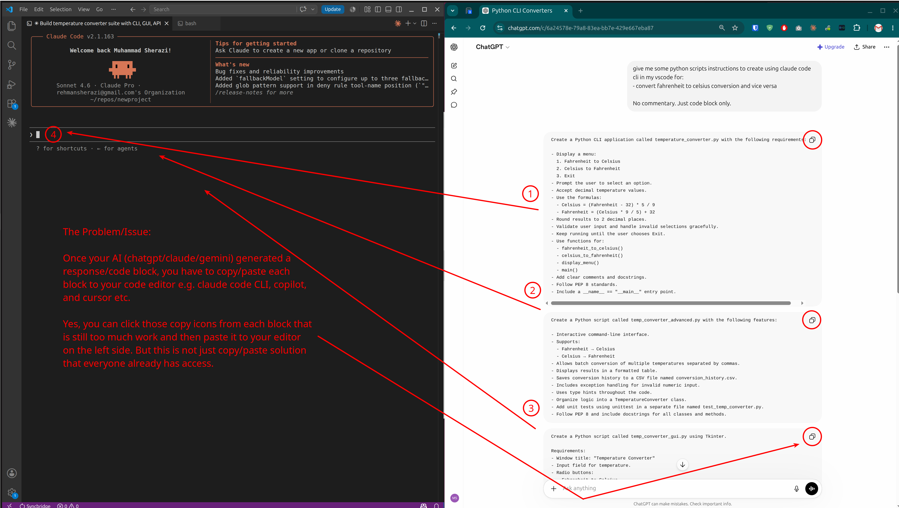
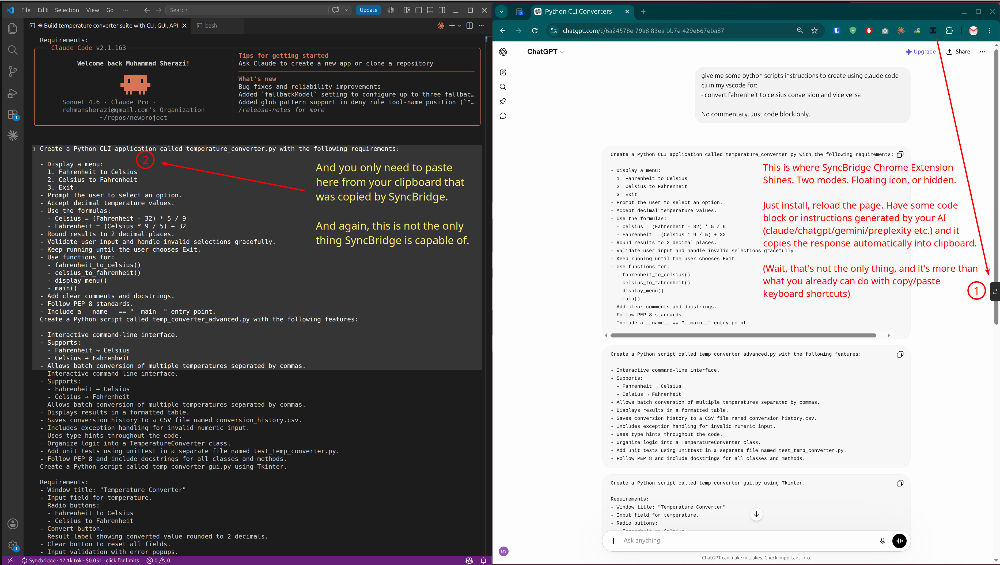
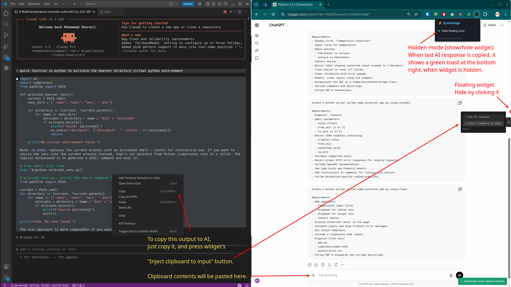
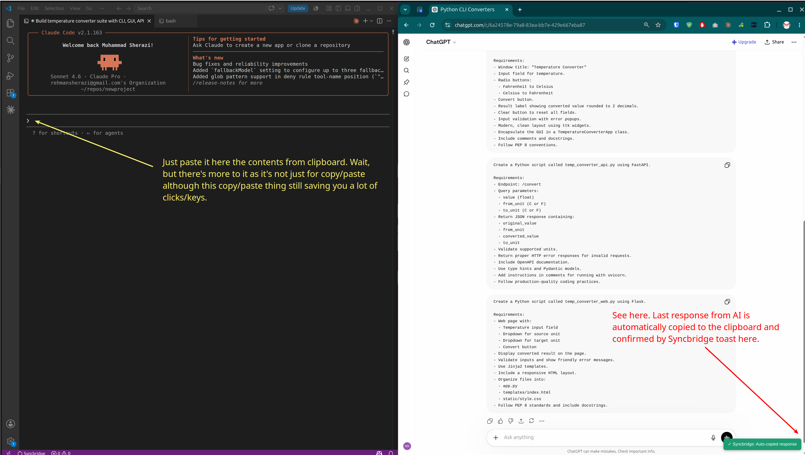
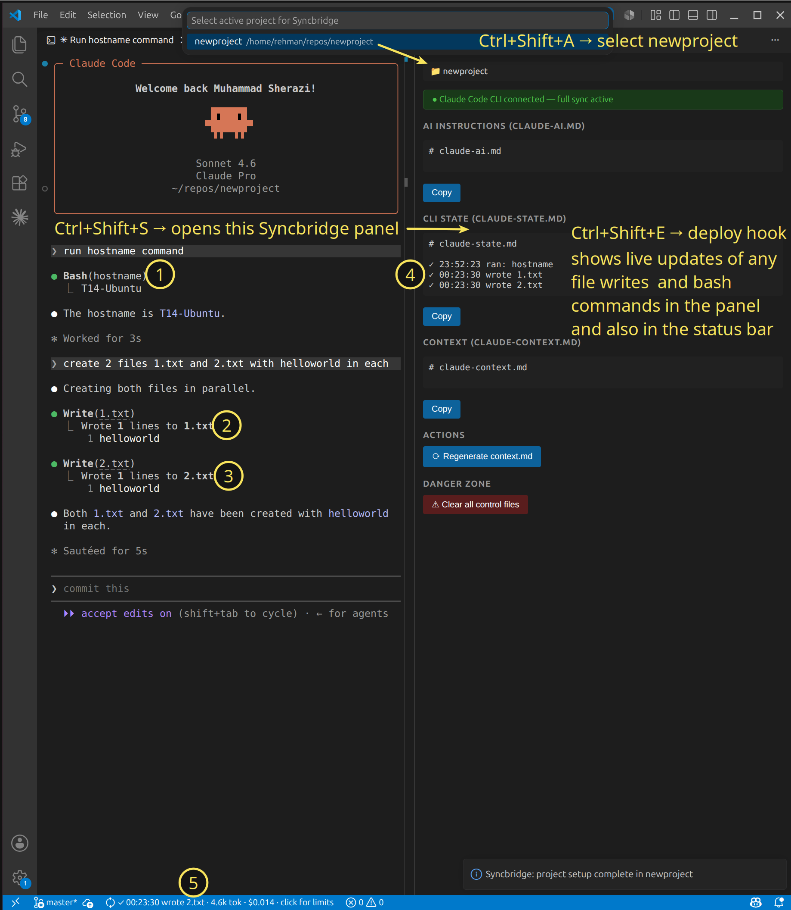
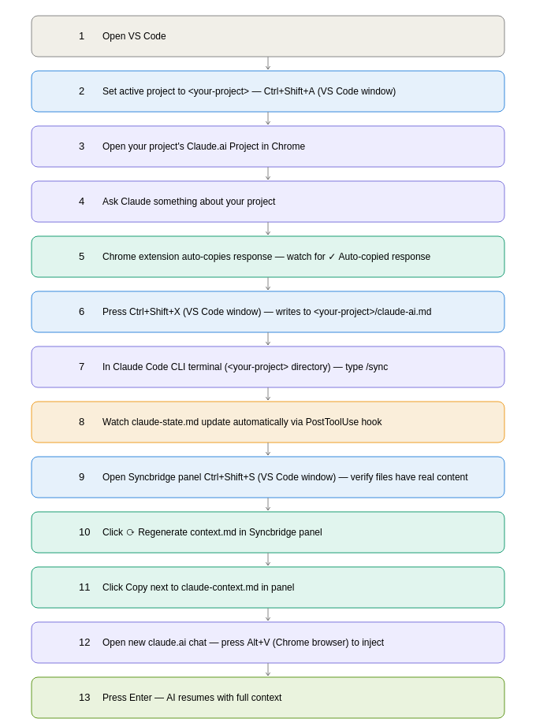

# Syncbridge

> *You're 30 messages deep with Claude. The plan is solid. Now you need to build it
> in your editor. So you copy. You paste. You lose half the context. Your editor
> doesn't know what Claude knows. And next time you go back to Claude, it doesn't
> know what your editor did.*
>
> *Syncbridge fixes this — automatically, for free, no CLI required.*

[](https://marketplace.visualstudio.com/items?itemName=rehmansherazi.syncbridge)
[](https://github.com/rehmansherazi/syncbridge)
[](https://www.npmjs.com/package/syncbridge-mcp)
[](LICENSE.txt)

---

## The Problem

Every developer using AI chat faces the same daily toil:

- AI gives a long response with 5 code blocks — you copy block 1, switch to your editor, paste, switch back, scroll to find block 2, copy, switch, paste, repeat
- You make a change in your editor — you want AI feedback — you copy the code, switch to browser, paste, ask the question
- Your chat gets too long — you start a new one — and re-explain your entire project from scratch
- You use ChatGPT for one thing and Claude for another — context never carries over
- You ask Claude for the plan and Cursor to build it — they never know what the other did
- You use Cursor — it can send terminal output to its own AI chat, but there's no way to send AI chat responses back to your terminal automatically
- You use Copilot or Windsurf — there's no bridge at all between their AI and your browser-based AI chats

**This is the copy-paste tax. It compounds every single day.**

Syncbridge eliminates it.

> *Built independently to solve a daily frustration. Turns out even well-funded teams
> with dedicated AI editors only solved half this problem. Syncbridge solves both directions
> — and works with every AI site, not just one editor's built-in chat.*

---

## Who is this for

**You don't need a CLI. You don't need a paid subscription. You just need a browser.**

| Who | Pain | What Syncbridge gives them |
|-----|------|---------------------------|
| Developers using free AI chat | Copy-paste between browser and editor all day | Auto-copy + one-keystroke inject |
| Students and bootcamp learners | Re-explaining project context in every new chat | Context migration in one click |
| Freelancers | Losing context between client sessions | Persistent context across chats |
| Multi-model users | Switching between Claude, ChatGPT, Gemini manually | Alt+C on one, Alt+V on another |
| Claude Code / Cursor / Copilot CLI users | AI chat and CLI never in sync | Full bidirectional auto-sync |
| Cursor users | Terminal→AI exists in Cursor but AI→terminal is missing | Completes the missing direction + works with any browser AI |
| Copilot and Windsurf users | No terminal↔AI bridge at all in browser | Full bidirectional sync with any AI chat site |
| Content creators and technical writers | Copy-pasting AI drafts into editors all day | Auto-copy eliminates the switching |
| Cost-sensitive developers | Claude Code CLI too expensive | Chrome extension is completely free |
| VS Code power users | Always hunting for better AI workflow tools | Install in 30 seconds, works immediately |

**Free forever. No API key. No subscription. No CLI required.**

---

## Quick Start

### Path A — Chrome extension only (no CLI needed)
1. Clone or download this repo
2. Go to `chrome://extensions` → enable Developer mode → Load unpacked → select `chrome-extension/` folder
3. Go to any supported AI site — ask something — response auto-copies to clipboard
4. Press `Alt+V` on any other AI site to inject it

That's it. No VS Code extension needed. No CLI. No setup.

**Chrome Web Store version coming soon.**

### Path B — Full sync (Chrome + VS Code + CLI)
1. Install VS Code extension: search "Syncbridge" in Extensions panel
2. Load Chrome extension (same as Path A step 2)
3. Press `Ctrl+Shift+A` (Mac: `Cmd+Shift+A`) → select your project folder
4. Press `Ctrl+Shift+E` (Mac: `Cmd+Shift+E`) → deploy file watcher hook
5. Press `Ctrl+Shift+S` (Mac: `Cmd+Shift+S`) → open Syncbridge panel
6. Run `claude` (or your CLI) from your project folder in terminal

You're ready. Ask your AI something — Syncbridge handles the rest.

---

## What it does

Syncbridge works in two independent layers — use one or both:

**Chrome extension only** — works for everyone, no CLI needed:
- Auto-copies AI response to clipboard when it finishes
- Alt+C to manually copy, Alt+V to inject into any AI input
- Switch context between Claude, ChatGPT, Gemini, Grok, Mistral, Perplexity, Copilot with one keystroke
- Green toast confirms copy even when widget is hidden

**VS Code extension + Chrome extension** — full bidirectional sync:
- AI response auto-copied → one keystroke sends to your CLI instructions file
- CLI runs tasks → VS Code panel shows every action live
- Context migration rebuilds your session for a fresh chat

**Supported AI chat interfaces (Chrome extension):**
- Claude.ai
- ChatGPT
- Google Gemini
- Perplexity
- Grok (x.ai)
- Mistral
- Microsoft Copilot

**Supported coding CLIs (VS Code extension):**
- Claude Code (full auto-sync with hooks)
- Cursor
- GitHub Copilot CLI
- Windsurf
- Aider
- Custom (user-defined file names)

---

## Screenshots

### The Problem — Manual copy-paste between AI and CLI


### The Solution — Syncbridge auto-copies AI responses


### Two Modes — Floating widget and hidden mode with toast notification


### Hidden Mode — Green toast confirms auto-copy when widget is hidden


### Live CLI State — VS Code panel updates in real time as CLI runs


---

## How it works

**AI → CLI** — Ask your AI something. Chrome extension auto-copies the response when it finishes. Press `Ctrl+Shift+X` (Mac: `Cmd+Shift+X`) in VS Code to write it to your instructions file. Run `/sync` in Claude Code CLI to execute.

**CLI → AI** — Claude Code CLI runs tasks and the hook auto-updates `claude-state.md` after every file write and bash command. The VS Code panel shows these updates live. Copy the state and paste into any AI chat to resume with full context.

**Context migration** — When your chat gets long, click ⟳ Regenerate in the Syncbridge panel. It merges your last instructions and last 10 CLI actions into a structured migration prompt. Paste into a new chat — the AI picks up exactly where you left off.

---

## Architecture

- **VS Code extension** — sidebar panel, file watcher, status bar, clipboard bridge, project hook deployment
- **Chrome extension** — floating widget UI, site adapters for each AI platform, auto-copy on response complete
- **MCP server** — optional Claude Code CLI integration via MCP tools

---

## Installation

### VS Code Extension

**From Marketplace:**
Search "Syncbridge" in the Extensions panel and click Install.

**From .vsix file:**
```bash
code --install-extension syncbridge-0.1.0.vsix
```

### Chrome Extension

**Developer mode (available now):**
1. Download or clone this repo
2. Go to `chrome://extensions`
3. Enable Developer mode
4. Click Load unpacked → select `chrome-extension/` folder

**Chrome Web Store:** Under review — available soon.

### MCP Server (Claude Code CLI)

```bash
claude mcp add syncbridge npx syncbridge-mcp
```

Available MCP tools:
- `update_state` — push CLI state to Syncbridge
- `read_instructions` — pull latest AI instructions
- `get_context` — get full merged context
- `clear_state` — reset state for a new session

---

## VS Code Extension

### Commands
| Command | Description |
|---------|-------------|
| `Syncbridge: Open Panel` | Open the sync panel in column two |
| `Syncbridge: Send Clipboard to CLI` | Write clipboard content to instructions file |
| `Syncbridge: Set Active Project` | Set the active project folder |
| `Syncbridge: Setup Project` | Deploy file watcher hook to current project |

### Panel UI
Opens in VS Code's second column. Displays live contents of all three control files with:
- **Copy** button per file
- **⟳ Regenerate context.md** — rebuilds migration prompt from current state
- **⚠ Clear all control files** — resets all three files

The panel auto-refreshes whenever the state file changes on disk.

### Status Bar
Shows last CLI action in the status bar. Click to open Claude.ai usage page.
Updates automatically when `claude-state.md` changes — no manual reload needed.

### activeCli Setting
Syncbridge adapts control file names based on which CLI you use.

Go to VS Code Settings → search "syncbridge" → set **Active CLI**:

| Setting | Instructions file | State file | Context file |
|---------|------------------|------------|--------------|
| claudecode (default) | claude-ai.md | claude-state.md | claude-context.md |
| cursor | cursor-ai.md | cursor-state.md | cursor-context.md |
| copilot | copilot-ai.md | copilot-state.md | copilot-context.md |
| windsurf | windsurf-ai.md | windsurf-state.md | windsurf-context.md |
| aider | aider-ai.md | aider-state.md | aider-context.md |
| custom | user-defined | user-defined | user-defined |

Non-Claude Code CLIs show an amber banner in the panel — state file must be updated manually for those CLIs.

---

## Chrome Extension

### Features
- Slim right-edge floating widget — hover to expand, click tab to pin open
- Draggable vertically along the right edge
- X button on hover removes widget from page — runs silently in background
- Toolbar popup to show/hide floating widget from Chrome extensions bar
- Auto-copies AI response to clipboard when response finishes (one copy per response)
- Green toast notification confirms auto-copy — visible even when widget is hidden
- Site adapters with per-site selectors for reading output and injecting input

### Supported Sites
Claude.ai · ChatGPT · Google Gemini · Perplexity · Grok · Mistral · Microsoft Copilot

---

## Keyboard Shortcuts

| Shortcut (Windows/Linux) | Shortcut (Mac) | Where | Action |
|--------------------------|----------------|-------|--------|
| Ctrl+Shift+S | Cmd+Shift+S | VS Code | Open Syncbridge panel |
| Ctrl+Shift+X | Cmd+Shift+X | VS Code | Send clipboard to instructions file |
| Ctrl+Shift+A | Cmd+Shift+A | VS Code | Set active project |
| Ctrl+Shift+E | Cmd+Shift+E | VS Code | Setup current project (deploy hook) |
| Alt+C | Option+C | Chrome | Copy AI response to clipboard |
| Alt+V | Option+V | Chrome | Inject clipboard into AI input |

**To remap VS Code shortcuts:**
- Edit `contributes.keybindings` in `package.json`, recompile and reinstall
- Or use VS Code built-in editor: `Ctrl+K Ctrl+S` (Mac: `Cmd+K Cmd+S`)

**To remap Chrome shortcuts:**
Edit the `keydown` listener in `chrome-extension/src/bot.js` then reload at `chrome://extensions`.

---

## Control Files

All three files are created automatically in the workspace root on first activation.
File names adapt based on your `activeCli` setting (see above).

| File (claudecode default) | Direction | Purpose |
|---------------------------|-----------|---------|
| `claude-ai.md` | AI → CLI | Instructions from chat; `/sync` reads and executes |
| `claude-state.md` | CLI → AI | Auto-updated by hook after every file write and bash command |
| `claude-context.md` | Shared | Migration prompt; rebuilt by ⟳ Regenerate button |

---

## Context Migration

Use when your chat gets too long or context drifts.



**Steps:**
1. Click **⟳ Regenerate context.md** in the Syncbridge panel
2. Merges last instructions + last 10 CLI actions into a structured prompt
3. Copy `claude-context.md` contents
4. Paste into a new chat — AI resumes exactly where you left off

**When to use:**
- Chat responses are drifting or losing accuracy
- Starting a new day on the same project
- Switching between AI models mid-session

---

## File Watcher Hook

The hook is configured in `.claude/settings.json` and fires automatically after every file write and bash command by Claude Code CLI.

Deploy to a project: Press `Ctrl+Shift+E` (Mac: `Cmd+Shift+E`) in VS Code.

To copy manually to another project:
```bash
cp .claude/settings.json <project>/.claude/
```

Hook captures:
```
✓ HH:MM:SS wrote <file_path>
✓ HH:MM:SS ran: <command>
```

---

## Multi-Folder Workspace

When workspace has multiple root folders, active root resolves in this order:
1. Folder containing the currently open file
2. Folder set via `Ctrl+Shift+A` (Mac: `Cmd+Shift+A`)
3. First folder in workspace list as fallback

---

## Roadmap

<!-- PLACEHOLDER: SEP-24 and beyond — future improvements planned -->
- [ ] Auto-detect installed CLIs on first run
- [ ] Chrome Web Store public release
- [ ] Onboarding walkthrough for first-time users
- [ ] Additional AI platform adapters
- [ ] Improved context migration with token awareness

---

## Requirements

- VS Code 1.100.0 or higher
- Node.js v18+
- At least one supported CLI (Claude Code, Cursor, Copilot CLI, Windsurf, or Aider)
- Chrome or Chromium-based browser for the Chrome extension

---

## Extension Test Runner

Tests live in `src/test/extension.test.ts` — 7 deterministic tests covering control file creation, write stability, append ordering, context regeneration, and extension activation.

To run: click the beaker icon (Testing) in VS Code sidebar → press ▷ Run All Tests.

All tests must pass before packaging.

---

## Development

Built using VS Code Extension API + Claude Code CLI with a deterministic SEP-based workflow.

Repository: https://github.com/rehmansherazi/syncbridge

---

## Known Limitations

- Chrome extension site adapters use fallback selector chains — resilient to minor DOM changes but major site redesigns may require an update
- File watcher hook requires manual setup per project via `Ctrl+Shift+E` (Mac: `Cmd+Shift+E`)
- Auto-sync hook only available for Claude Code CLI — other CLIs require manual state file updates
- CLI sync requires the CLI to be running from the project directory that has the hook deployed

---

## Privacy

Syncbridge does not collect, transmit, or store any user data on external servers.

- Clipboard access is used only to read AI responses and write context locally to your project files
- Storage permission saves only widget visibility state in your browser locally
- No analytics, no tracking, no telemetry
- No data leaves your machine
- All processing happens locally between your browser, VS Code, and terminal

For questions: mrsherazi@hotmail.com
